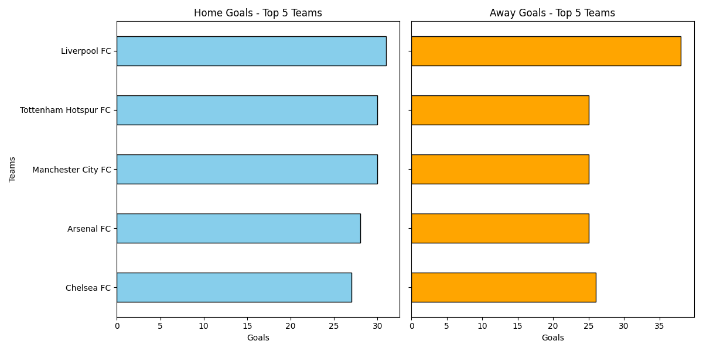

# Premier League Goal Split
Analyzes home and away goals for the top 5 Premier League teams in 2024/25.

## Features
- Fetches match data via the [football-data.org API](https://www.football-data.org/).
- Breaks down goals by team and location (home/away) using Python and Pandas.
- Visualizes top 5 teams with dual bar charts (Matplotlib).

## Output

## How to Run
1. Sign up for a free API key at [football-data.org](https://www.football-data.org/).
2. Replace `YOUR_API_KEY_HERE` in `script.py` with your key.
3. Install dependencies: `pip install requests pandas matplotlib`
4. Run: `python script.py`

## Files
- `script.py`: Main code.
- `home_away_goals.png`: Bar charts of top 5 teams.
- `team_goals_table.csv`: Raw team data.
